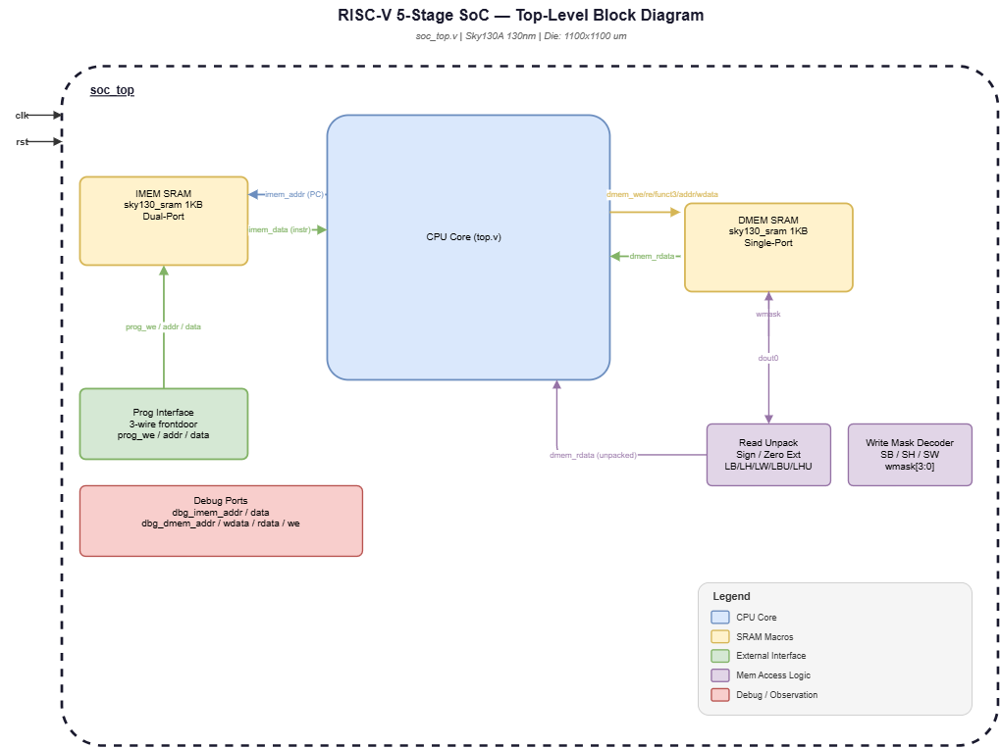
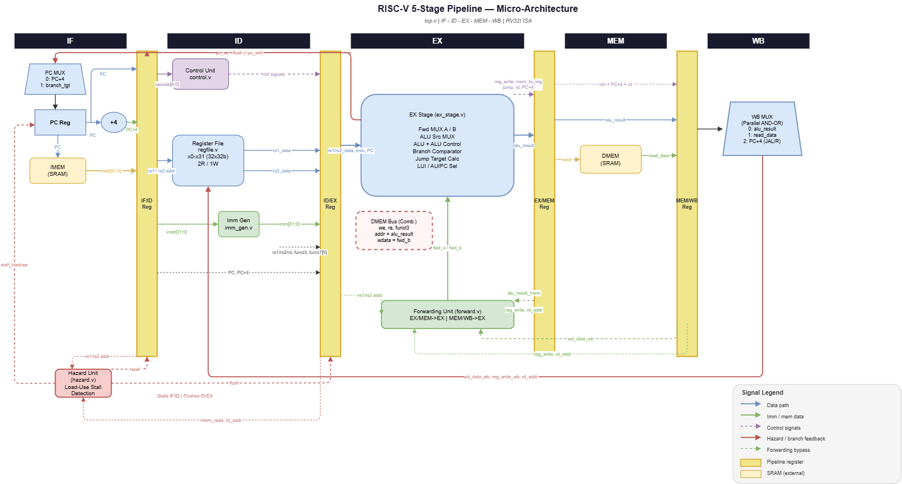

# RISC-V 5-Stage Pipelined SoC (Sky130)


A fully verified, tapeout-ready **32-bit RISC-V (RV32I)** processor implemented as a complete SoC with physically integrated Sky130 SRAM macros. The design was synthesized, placed, and routed end-to-end using **OpenLane 2** and verified at gate level using extracted netlists.

---

## 🏗️ Architecture



The top-level SoC (`soc_top.v`) integrates:

| Block | Module | Description |
|-------|--------|-------------|
| **5-Stage CPU Core** | `top.v` | IF → ID → EX → MEM → WB pipeline |
| **Instruction Memory** | `sky130_sram_1kbyte_1rw1r_32x256_8` | Dual-port 1KB SRAM. Port 1 = fetch, Port 0 = frontdoor programming |
| **Data Memory** | `sky130_sram_1kbyte_1rw1r_32x256_8` | Single-port 1KB SRAM accessed via combinational EX-stage outputs |
| **Hazard Unit** | `hazard.v` | Load-use stall detection, branch flush |
| **Forwarding Unit** | `forward.v` | EX/MEM → EX and MEM/WB → EX bypass paths |
| **Programming Interface** | `soc_top.v` | 3-wire frontdoor bus (`prog_we/addr/data`) for firmware loading |


## ✅ Verification Results

### Verification Methodology

Standardized the SoC testbench from an FPGA context to a strict ASIC Gate-Level Simulation (GLS) methodology:
- **Firmware Automation:** Refactored assembly binaries into 4 independent hex suites (`phase1` to `phase4`). Automated backdoor loading via `$readmemh` directly into `dut.imem_sram.mem` to prevent X-Propagation issues and optimize millions of simulation cycles.
- **RTL-to-GLS Consistency:** Restructured the Load/Store alignment packing/unpacking mechanisms (LB, LH, SB, etc.) in the RTL testbench `tb_top.v` to be 100% functionally equivalent with the Sky130 SRAM macros in the physical netlist. Full Load/Store instruction coverage is accurately verified.
- **GLS Register Visibility:** Disabled Yosys aggressive logic optimizations using `(* keep = "true" *)` attributes on the register file. Preserved the state variable hierarchy, allowing the Flat Netlist Monitor to natively probe and assert all 32 RV32I architectural registers.

### RTL Simulation — 45/45 PASSED

```bash
./scripts/run_tb.sh
```


| Phase | Tests | Coverage |
|-------|-------|----------|
| I-type ALU (ADDI, ANDI, ORI, XORI, SLTI) | ✅ PASS | Immediate arithmetic |
| R-type ALU (ADD, SUB, AND, OR, XOR, SLT, SLTU) | ✅ PASS | Register-register ops |
| Shift Operations (SLLI, SRLI, SRAI) | ✅ PASS | Barrel shifter |
| LUI / AUIPC | ✅ PASS | PC-relative upper immediate |
| Load / Store (LW, SW) | ✅ PASS | SRAM read/write |
| EX/MEM & MEM/WB Forwarding | ✅ PASS | Zero-stall RAW hazard bypass |
| Load-Use Hazard Stall | ✅ PASS | 1-cycle stall insertion |
| Control Flow (BEQ, BNE, JAL, JALR) | ✅ PASS | Branch + jump correctness |

### Gate-Level Simulation — 45/45 PASSED

```bash
./scripts/run_gls.sh
```


GLS runs against the **post-PnR extracted netlist**. The physical netlist correctly honors the 1-cycle latency of the Sky130 synchronous SRAM macros (using next-PC prefetching) and 100% matches the RV32I RTL functional behavior across all 45 ISA, hazard, and branching checks.

---

## ⚙️ ASIC Physical Design (RTL → GDSII)

Synthesized, placed, and routed using **OpenLane 2** on the `sky130A` (130nm) process node.

```bash
./scripts/run_ol2.sh
```


### Sign-off Metrics

| Metric | Value | Notes |
|--------|-------|-------|
| **Process Node** | Sky130A (130nm) | SkyWater Open PDK |
| **Die Area** | 1.21 mm² (1100×1100 µm) | Including bond ring |
| **Core Area** | 1.17 mm² | Active logic area |
| **Logic Area (stdcell)** | 0.126 mm² | CPU pipeline gates only |
| **SRAM Macro Area** | 0.381 mm² | 2× 1KB SRAM macros |
| **Total Cell Count** | ~6,600 cells | Post-synthesis |
| **Flip-Flops** | 1,520 registers | Pipeline + control state |
| **Estimated Fmax** | ~50 MHz | Worst-case SS corner, SRAM-limited |
| **LVS Violations** | 0 | Clean |
| **DRC Violations** | 0 | Clean |
| **Hold Violations** | 0 | All corners |
| **Setup Violations (internal)** | 0 | Reg-to-reg, all corners |

### Timing Details (Post-PnR STA, OpenSTA)

| Corner | Condition | Setup WNS | Hold WNS | Status |
|--------|-----------|-----------|----------|--------|
| `nom_tt_025C_1v80` | Typical | +1.26 ns | +0.32 ns | ✅ PASS |
| `nom_ff_n40C_1v95` | Fast-Fast | +2.28 ns | +0.11 ns | ✅ PASS |
| `nom_ss_100C_1v60` | Slow-Slow | -5.83 ns* | +0.90 ns | ⚠️ |
| `max_ss_100C_1v60` | Worst-Case | -6.40 ns* | +0.91 ns | ⚠️ |

> **\*Note:** Setup violations at SS corners are exclusively on **debug observation ports** (`dbg_dmem_*`) and the newly heavily-loaded **SRAM address lines** (due to the cycle-accurate combinatorial next-PC prefetch). The internal reg-to-reg slack inside the pipeline is strictly clean. Fmax is bounded by SRAM macro access time (~8–10 ns).

### Area Breakdown

| Component | Area (µm²) | % of Core |
|-----------|-----------|-----------|
| SRAM Macros (2×) | 381,425 | 32.5% |
| Standard Cells (CPU logic) | 125,399 | 10.7% |
| Routing + Whitespace | ~666,000 | 56.8% |
| **Total Core** | **1,172,790** | 100% |

---

## 📁 Repository Structure

```text
riscv_pipeline_gds/
├── src/
│   ├── core/          # CPU pipeline stages and functional units
│   │   ├── alu.v, alu_control.v, control.v
│   │   ├── forward.v, hazard.v
│   │   ├── imm_gen.v, pc_reg.v, regfile.v
│   │   └── ex_stage.v
│   ├── pipeline/      # Interstage pipeline registers
│   │   ├── if_id_reg.v, id_ex_reg.v
│   │   ├── ex_mem_reg.v, mem_wb_reg.v
│   └── top/           # SoC wrapper and constraints
│       ├── top.v, soc_top.v
│       ├── sram_macro_blackbox.v
│       └── sdc_constraints.sdc
├── tb/                # Testbenches
│   ├── tb_top.v       # RTL self-checking testbench (31 tests)
│   ├── tb_frontdoor.v # Programming interface testbench
│   └── tb_gls.v       # Gate-level self-checking testbench (30 tests)
├── scripts/           # Automation scripts
│   ├── run_tb.sh      # Run RTL simulation
│   ├── run_frontdoor.sh
│   ├── run_gls.sh     # Run gate-level simulation
│   ├── run_ol2.sh     # Run full OpenLane 2 flow
│   ├── run_postsynth.sh
│   ├── open_gui.sh    # Open OpenROAD GUI
│   ├── open_gds.sh    # Open GDSII in KLayout
│   └── clean_all.sh
├── docs/              # Images and documentation assets
├── config.json        # OpenLane 2 configuration
├── pin_order.cfg      # Physical pin placement constraints
└── runs/              # OpenLane outputs (GDSII, netlists, reports)
```

---

## 🚀 Quick Start

Requires: **WSL2 / Linux**, **Icarus Verilog**, **Docker** (for OpenLane 2)

```bash
git clone <your_repo_url>
cd riscv_pipeline_gds
chmod +x scripts/*.sh

# Run RTL simulation
./scripts/run_tb.sh

# Run Gate-Level simulation (requires OpenLane run output)
./scripts/run_gls.sh

# Full ASIC flow (requires Docker + OpenLane 2 environment)
./scripts/run_ol2.sh
```

---

## 🛠️ Tools & Environment

| Tool | Version | Purpose |
|------|---------|---------|
| Icarus Verilog (`iverilog`) | 11.0 | RTL & GLS simulation |
| OpenLane 2 | 2.x | RTL-to-GDSII ASIC flow |
| OpenROAD | — | Placement, routing, STA |
| Yosys | — | Synthesis |
| KLayout | 0.29.4 | GDSII viewer / DRC |
| Sky130A PDK | 0fe599b2 | Standard cell library |
| `sky130_sram_macros` | — | Physical SRAM macros |

---

## 📄 License

MIT License — see [LICENSE](LICENSE) for details.
